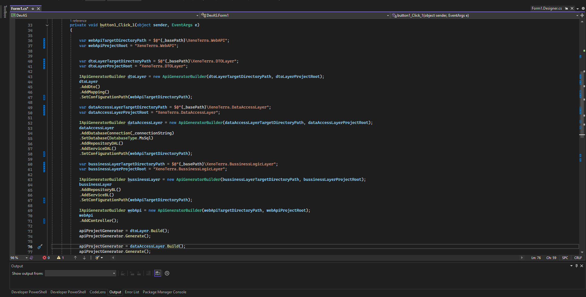

# ⚡ Xegnx API Generator Showcase — Next-Level API Generator

 

 

## 📌 Project Overview

**Xegnx API Generator** is a powerful internal tool that generates **clean, production-ready .NET REST APIs** in seconds. Currently, it focuses on generating **.NET-based APIs**, but the long-term goal is to support **multiple technologies and architectures** beyond .NET.

 

By providing structured **input folders** (especially the `Entities` folder), **output paths**, and **project patterns**, it automatically creates the entire backend structure — from repositories to controllers — following the **Repository Design Pattern** and clean code principles.

 

During the **project generation process**, the **Builder Design Pattern** is used to construct projects step by step in a flexible and maintainable way.

> This repository serves as a **showcase** for the tool’s capabilities. The actual source code is **not shared**, but its usage has already accelerated development in real projects like [**social-media-api-prototype**](https://github.com/Hereetria/social-media-api-prototype) and [**xeno-terra-api**](https://github.com/Hereetria/xeno-terra-api), where the entire API foundations were scaffolded with this generator.

 

## ✨ Features

- 🧠 **Entity-based Input** — Simply point to your `Entities` folder to define your data models  
- 🗂️ **Pattern-Aware Generation** — Configure folder paths and naming conventions to match your architecture  
- ⚙️ **.NET REST API Output** — Generates repository, service, and controller layers automatically  
- 🧱 **Repository Design Pattern** — All generated code follows a layered, maintainable structure  
- 🧼 **Clean Code** — Output adheres to best practices, enabling fast development without sacrificing quality  
- 🔧 **Auto DI Configuration** — Any new service is automatically registered in the dependency injection container  
- 🚀 **Development Accelerator** — Eliminates repetitive setup work and speeds up new project bootstrapping

 

## 🖼️ Screenshots
Shown below in order:  
**1. Inputs**

  
  
  

 

## 🧰 Tech Stack

  
  
  

 

## 📜 License

This project is licensed under the terms described in the [LICENSE](./LICENSE) file.

---

© 2025 Yusuf Okan Sirkeci — [Hereetria](https://github.com/Hereetria)
